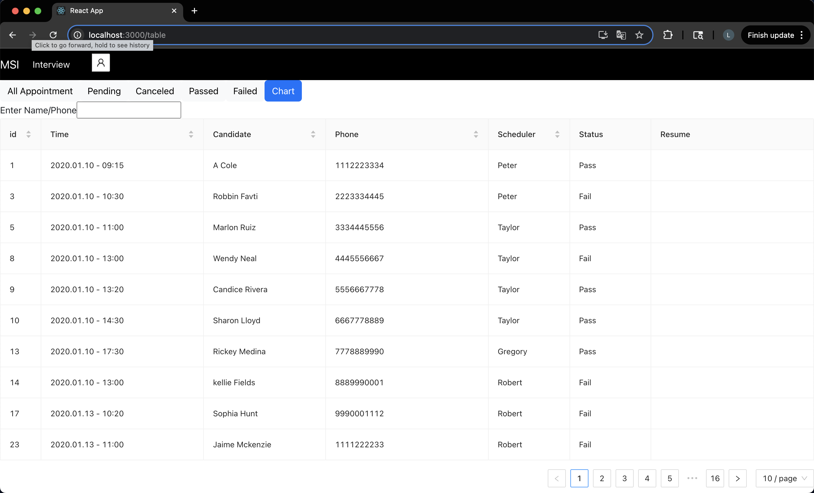
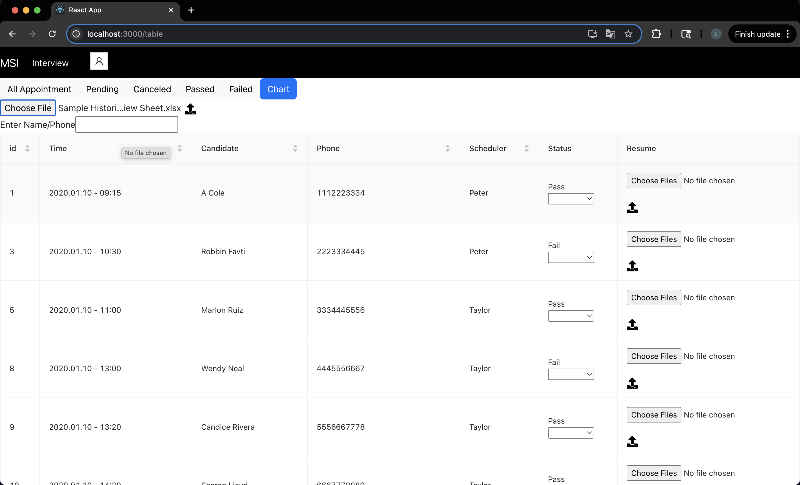
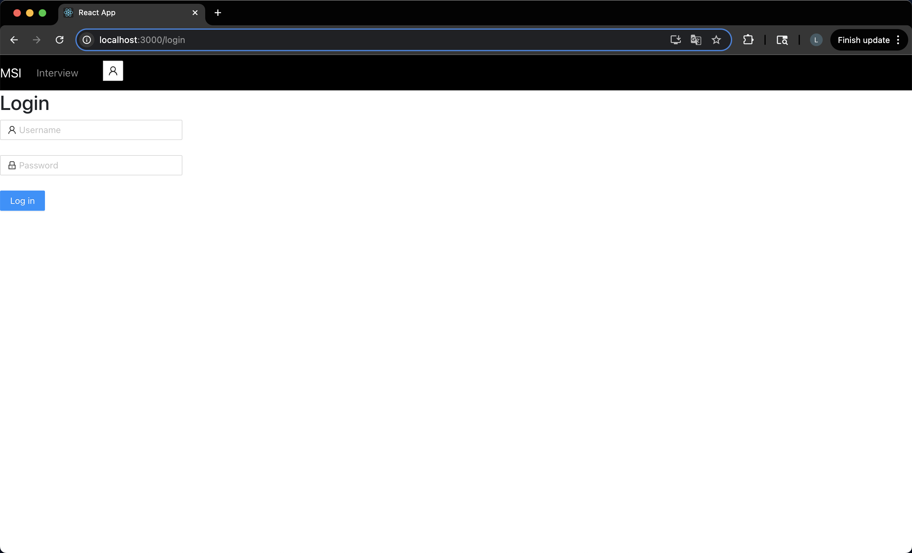
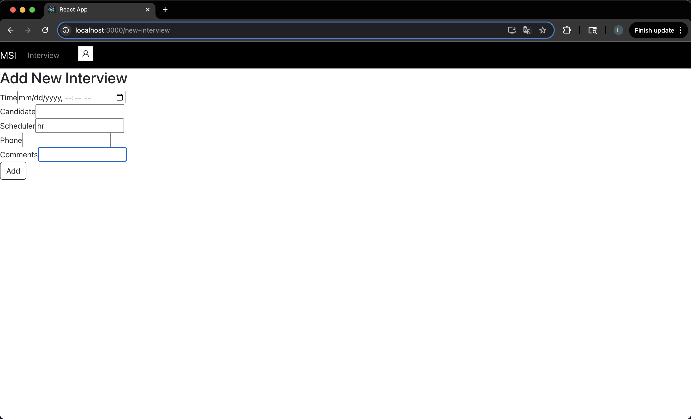
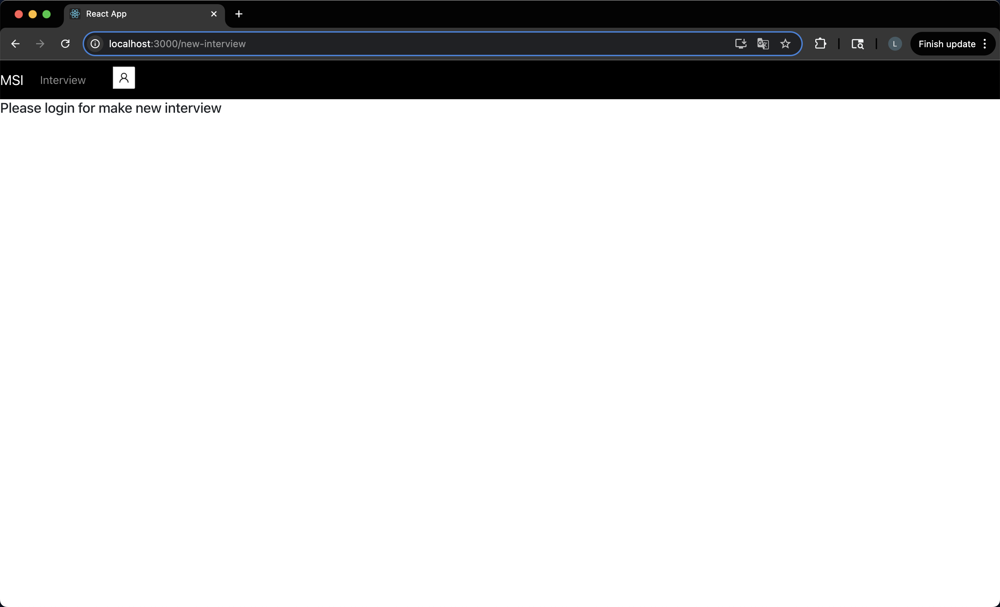
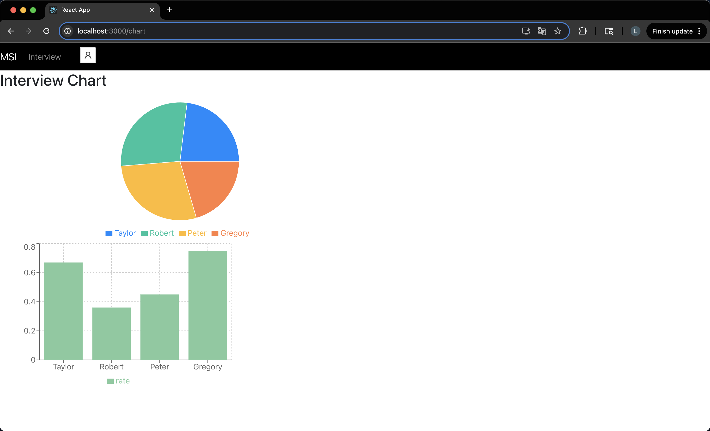
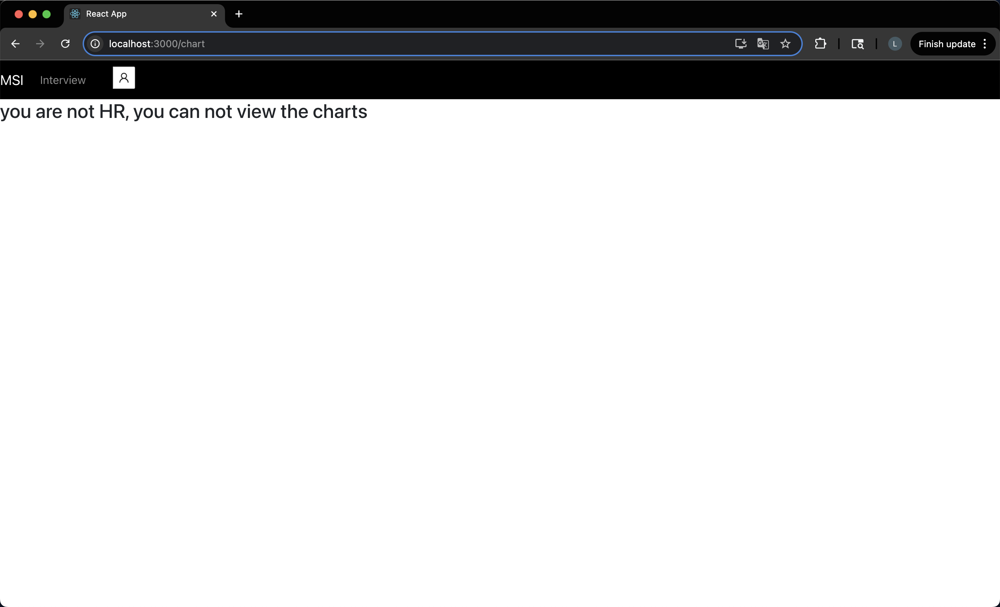

# 🚀 Interview Practice System


A **full-stack web application** for practicing technical interview system.

This project demonstrates a modern **full-stack architecture** using:

* Spring Boot REST API
* React frontend
* PostgreSQL cloud database
* Cloud deployment

---

# 🌐 Live Demo

Frontend
https://interviewdemo-frontend.onrender.com

Backend API
https://interviewdemo-backend.onrender.com

---

# 🧠 Project Overview

The Interview System allows users to:

* Browse interview status
* Add interview
* View the graphic
* Upload resume
* Search and filter Interview
* Interact with a RESTful backend API

This project was built to demonstrate **full-stack development skills** including backend API design, frontend UI development, and cloud deployment.

---

# 🛠 Tech Stack

## Backend

* Java
* Spring Boot
* Spring Data JPA
* Maven

## Frontend

* React
* Axios
* HTML / CSS
* JavaScript

## Database

* PostgreSQL

## Deployment

* Render (Backend)
* Render Static Site (Frontend)
* Render PostgreSQL Cloud Database

---

# 🏗 System Architecture

```
User Browser
     │
     ▼
React Frontend
     │
     ▼
REST API
     │
     ▼
Spring Boot Backend
     │
     ▼
PostgreSQL Database
```

---

# 📂 Project Structure

```
interviewDemo
│
├── interviewDemo_backend
│   ├── src/main/java
│   ├── src/main/resources
│   ├── pom.xml
│   └── application.properties
│
└── interviewDemo_frontend
    ├── src
    ├── public
    └── package.json
```

---

# ⚙️ Local Development

## Clone Repository

```
git clone https://github.com/yanling318/interviewDemo_backend.git
git clone https://github.com/yanling318/interviewDemo_frontend.git
cd interviewDemo
```

---

## Backend Setup

```
cd interviewDemo_backend
mvn spring-boot:run
```

Backend runs at:

```
http://localhost:8080
```

---

## Frontend Setup

```
cd interviewDemo_frontend
npm install
npm start
```

Frontend runs at:

```
http://localhost:3000
```

---

# 🔗 REST API

## Get All Users

```
GET /api/Users
```

Example response:

```
[
  {
    "id": 1,
    "username": "hr",
    "password": "******",
    "role": {"id":"1","type": "HR" }  
  }
{
    "id": 2,
    "username": "Trainer",
    "password": "******",
    "role": {"id":"2","type": "Trainer" }  
}
]
```

---

## register account

```
POST /api/register
```

Request body:

```
  {
    "id": 1,
    "username": "hr",
    "password": "123",
    "role": {"id":"1","type": "HR" }  
  }

```

---

# 🗄 Database Schema

Example table:

```
user
---------
id
username
password
role
```

---

# 📷 Screenshots

## Table Page
<p align="center">
     
     
</p>
## Login Page



## Add Interview

<p align="center">
     
     
</p>

## Chart Page
<p align="center">
     
     
</p>
---

# ✨ Key Features

* Full-stack architecture
* RESTful backend API
* React frontend UI
* PostgreSQL database integration
* Cloud deployment
* Responsive design

---

# 🚀 Deployment

## Backend

Hosted on Render

## Frontend

Static site hosted on Render

## Database

PostgreSQL hosted on cloud infrastructure

---

# 👨‍💻 Author

Ling Yan

GitHub
https://github.com/yanling318

---

# 📄 License

MIT License


